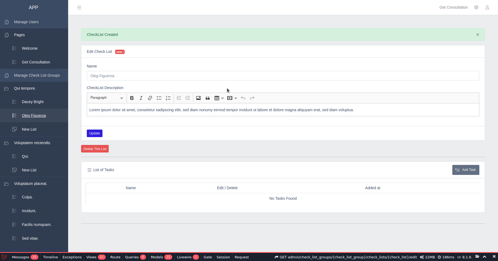

# checklister-crm

Creating an adminpanel-like system to manage checklists, tasks, CRUD operations and testing them.
---
## Screenshots

- Admin-panel


### Users page:

- Checklist Clone to User
- Each user have their own CheckList inheritance from Admin Base CheckList


---

The following must be installed and available on your terminal:

* [x] composer
* [x] npm

---

## Starting Project

1. install laravel packs
```composer
composer install
```

Run the following command to generate your app key:

```
php artisan key:generate
```

Create the symbolic link:

```
php artisan storage:link
```

Run the database migrations (**Set the database connection in .env before migrating**)

```
php artisan migrate
```

2. install npm and run
```npm
npm install
```
```npm
npm run dev
```

## Features to implement
| Task                                      | Desc                                       ||
| ----------------------------------------- |:------------------------------------------:|:--:|
| Installing Laravel, preparing repository  | Laravel.9                                  | ✅ |
| Add adminpanel design                     | Using CoreUI free theme                    | ✅ |
| Set up Roles and Permissions              | isAdmin Middleware                         | ✅ |
| managing checklist groups and checklists  | CheckList -a && CheckListGroup -a          | ✅ |
| managing tasks                            | Task -a                                    | ✅ |
| pages management                          |                                            | ✅ |
| User registration and welcome page        |                                            | ✅ |
| customers list                            |                                            | ✅ |

### Additional Admin sections:
- Customer data section where I can see customer registration data (name, email,
website) + add note and tags. ✅
- Customers Resource APIs ✅
- Order section where I can see all the customer in paid plan.
- Integration with Stripe for payments
- Integration with Google Analytics (works fine a javascript)
- Integration with email marketing provider ✅
- Multi-language (not for now but in the future)

----- 
Need helps? Reach me out

> Email: soulaimaneyahya1@gmail.com

> Linkedin: soulaimane-yahya

All the best :beer:
